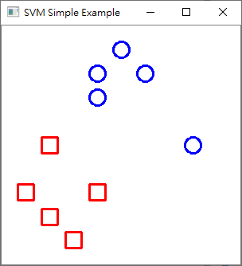
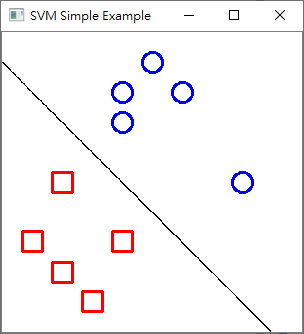
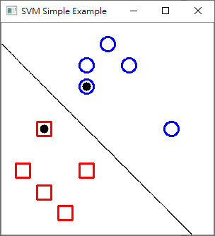
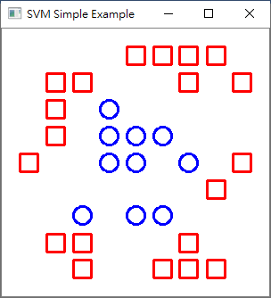
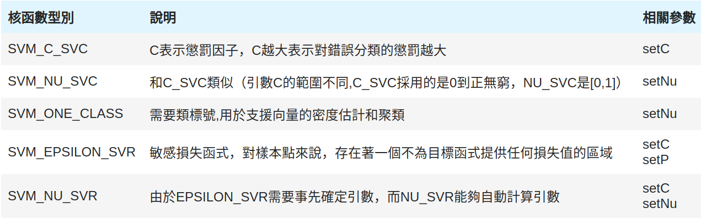
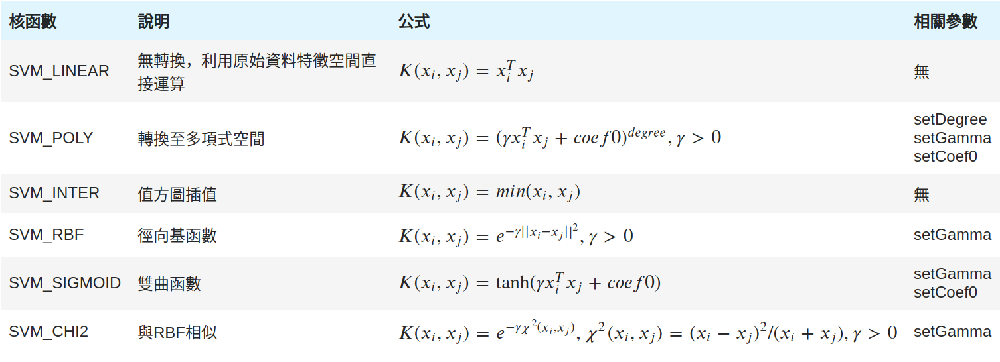
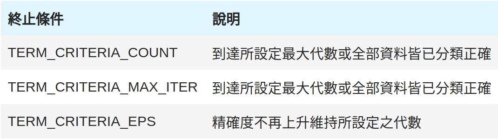
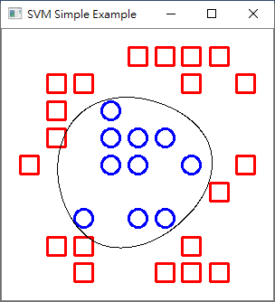

# Support Vector Machine 基本認識與使用

#### **1. 線性可分割資料**<br>
可用一條線或一個平面(決定邊界 Decision Boundary)將兩堆資料正確的分開，稱為線性可分割。若以x代表資料屬性、f(x)表示該決定邊界，那f(x) > 0屬於藍色組，反之則屬於紅色組。<br>
<br>
<font size="1" color = "gray">圖片來源：https://towardsdatascience.com/support-vector-machine-vs-logistic-regression-94cc2975433f</font><br>
上圖可看出有無限多條決定邊界都可以分割出兩堆資料，但能將兩堆資料分的越開，理論上應該最好、抗雜訊能力最強。因此SVM定義了支持向量(support vector)，這些支持向量所決定的超平面能使兩堆資料的邊界(Margin)最大；另外在分割大型資料集時，只須考慮支持向量上的各點，不用考慮所有資料，可大幅降低計算量。<br>
<br>
<font size="1" color = "gray">圖片來源：https://towardsdatascience.com/support-vector-machine-vs-logistic-regression-94cc2975433f</font><br>

#### 導入將使用到的模組
- numpy: 常用數學計算、矩陣資料型態
- cv2: OpenCV模組
- pandas: 此處用來讀取csv檔案的模組


```python
import numpy as np
import cv2 as cv
import pandas as pd
import random
```

---
#### 載入線性可分割資料集並印出查看
- 屬性 
    - X: 直角坐標X軸座標(0~1)
    - Y: 直角坐標Y軸座標(0~1)
- 類別: 
    - 0: 表示藍色圓形
    - 1: 表示紅色矩形
- 統計:
    - 10 筆資料
    - 紅色與藍色各5筆


```python
data = pd.read_csv('data/simple_linear.csv')
print(data)
```

         x    y  label
    0  0.4  0.3      0
    1  0.4  0.2      0
    2  0.5  0.1      0
    3  0.6  0.2      0
    4  0.8  0.5      0
    5  0.1  0.7      1
    6  0.2  0.5      1
    7  0.2  0.8      1
    8  0.3  0.9      1
    9  0.4  0.7      1


---
#### 資料前處理
- 將資料集屬性與類別分開方便訓練


```python
trainData = data[['x', 'y']].values
label = data[['label']].values
print('train data:\n', trainData)
print('label:\n', label)
```

    train data:
     [[0.4 0.3]
     [0.4 0.2]
     [0.5 0.1]
     [0.6 0.2]
     [0.8 0.5]
     [0.1 0.7]
     [0.2 0.5]
     [0.2 0.8]
     [0.3 0.9]
     [0.4 0.7]]
    label:
     [[0]
     [0]
     [0]
     [0]
     [0]
     [1]
     [1]
     [1]
     [1]
     [1]]


- 將資料集格式轉成OpenCV的SVM訓練格式 


```python
trainData = trainData.astype(np.float32)
trainData = np.asmatrix(trainData)
```

- 將資料以二維座標圖呈現的畫圖函數（可跳過）


```python
def draw_data_dist(data, label, model = None, sv = np.array([])):
    amp = 300; size = 10
    Blue = (255, 0, 0)
    Red = (0, 0, 255)
    image = np.ones((amp, amp, 3), dtype = np.uint8)*255
    data = data * amp
    
    for i in range(data.shape[0]):
        if label.item(i) == 0:
            replace = (int(data.item((i,0))), int(data.item((i,1))))
            cv.circle(image, replace, size, Blue, 2)
        else:
            rep_tl = tuple((data - size).astype(np.int32).A[i])
            rep_br = tuple((data + size).astype(np.int32).A[i])
            cv.rectangle(image, rep_tl, rep_br, Red, 2)
    if model != None:
        temp = np.ones((amp, amp, 3), dtype = np.uint8)*255
        for i in range(amp):
            for j in range(amp):
                sample = np.matrix([[j, i]], dtype = np.float32) / amp
                response = int(model.predict(sample)[1][0,0])
                if response == 0: temp[i,j] = Blue 
                else: temp[i,j] = Red
        temp = cv.Canny(temp, 100, 200)
        temp = cv.cvtColor(temp, cv.COLOR_GRAY2BGR)
        image = cv.bitwise_and(image, cv.bitwise_not(temp))
    if sv.any():
        sv = sv * amp
        for i in range(sv.shape[0]):
            cv.circle(image, (sv[i, 0], sv[i, 1]), 6, (0, 0, 0), -1)
    return image      
```

- 將資料以二維座標圖呈現<br>



```python
result = draw_data_dist(trainData, label)
cv.imshow('SVM Simple Example', result)
cv.waitKey()
cv.destroyAllWindows()
```

#### SVM模型建置
此處先以最簡單的線性分割模型建置


```python
model = cv.ml.SVM_create()
model.setType(cv.ml.SVM_C_SVC)
model.setKernel(cv.ml.SVM_LINEAR)
model.setTermCriteria((cv.TERM_CRITERIA_MAX_ITER, 10000, 1e-6))
model.setC(100)
```

#### 訓練SVM模型
輸出為True表示訓練滿足設定目標；反之False則為失敗。


```python
model.train(trainData, cv.ml.ROW_SAMPLE, label)
```


    True


#### 模型訓練結果
比對目標與實際結果並統計正確率


```python
def get_acc(model, data, label):
    acc = 0
    print('label \t pred')
    for i in range(data.shape[0]):
        response = model.predict(data[i])[1]
        print(label[i], '\t', response)
        if model.predict(data[i])[1] == label[i]:
            acc = acc + 1
    print('==================')        
    print('accuracy: ', acc / data.shape[0])

get_acc(model, trainData, label)
```

    label 	 pred
    [0] 	 [[0.]]
    [0] 	 [[0.]]
    [0] 	 [[0.]]
    [0] 	 [[0.]]
    [0] 	 [[0.]]
    [1] 	 [[1.]]
    [1] 	 [[1.]]
    [1] 	 [[1.]]
    [1] 	 [[1.]]
    [1] 	 [[1.]]
    ==================
    accuracy:  1.0


#### 模型測試
- 將資料以二維座標圖呈現決定邊界<br>



```python
result = draw_data_dist(trainData, label, model)
cv.imshow('SVM Simple Example', result)
cv.waitKey()
cv.destroyAllWindows()
```

- 標註出Support Vector<br>



```python
sv = model.getUncompressedSupportVectors()
print(sv)
```

    [[0.4 0.3]
     [0.2 0.5]]


```python
result = draw_data_dist(trainData, label, model, sv)
cv.imshow('SVM Simple Example', result)
cv.waitKey()
cv.destroyAllWindows()
```

#### 模型存取


```python
model.save('./model/svm_simple_linear.xml')
model = cv.ml.SVM_load('./model/svm_simple_linear.xml')
```

#### **2. 非線性可分割資料**<br>
大部分資料分佈狀況通常不會是線性可分割資料，而SVM卻只能做線性分割怎麼辦？不能像下圖一樣用曲線將資料分開嗎？<br>

<br>
<font size="1" color = "gray">圖片來源：https://quantdare.com/svm-versus-a-monkey/</font><br>

- **特徵空間轉換**<br>
SVM透過特徵空間轉換，利用函數將原本的資料屬性導向到另一種屬性表示方式，這種函數稱為**核函數(kernel function)**，轉換後的資料分佈即可做線性分割，而此決定邊界投射在原始屬性空間即為曲線。
換句話說有紅球跟藍球在桌子上，發現兩種球的質量不同，大力一拍桌子，讓這些球飛到空中，你再拿一張白紙將兩種球分開。<br>

<br>
<font size="1" color = "gray">圖片來源：https://medium.com/jameslearningnote/%E8%B3%87%E6%96%99%E5%88%86%E6%9E%90-%E6%A9%9F%E5%99%A8%E5%AD%B8%E7%BF%92-%E7%AC%AC3-4%E8%AC%9B-%E6%94%AF%E6%8F%B4%E5%90%91%E9%87%8F%E6%A9%9F-support-vector-machine-%E4%BB%8B%E7%B4%B9-9c6c6925856b</font><br>

#### 載入非線性可分割資料集並視覺化
- 屬性 
    - X: 直角坐標X軸座標(0~1)
    - Y: 直角坐標Y軸座標(0~1)
- 類別: 
    - 0: 表示藍色圓形
    - 1: 表示紅色矩形
- 統計:
    - 30 筆資料
    - 紅色20筆、藍色10筆


```python
data = pd.read_csv('data/simple_unlinear.csv')
trainData = data[['x', 'y']].values
label = data[['label']].values
trainData = trainData.astype(np.float32)
trainData = np.asmatrix(trainData)
```




```python
result = draw_data_dist(trainData, label)
cv.imshow('SVM Simple Example', result)
cv.waitKey()
cv.destroyAllWindows()
```

#### SVM 模型建置
- setType:設定決定邊界評量標準<br>
    

- setKernel: 設定核函數計算方式，將原始特徵轉換到另一個表示空間。<br>
    

- setTermCriteria: 設定訓練終止條件<br>



```python
model = cv.ml.SVM_create()
model.setType(cv.ml.SVM_C_SVC)
model.setKernel(cv.ml.SVM_CHI2)
model.setTermCriteria((cv.TERM_CRITERIA_MAX_ITER, 10000, 1e-6))
model.setC(10000)
```

trainData = data[['x', 'y']].values
label = data[['label']].values

#### 訓練SVM模型


```python
model.train(trainData, cv.ml.ROW_SAMPLE, label)
```


    True


#### 模型訓練結果


```python
get_acc(model, trainData, label)
```

    label 	 pred
    [0] 	 [[0.]]
    [0] 	 [[0.]]
    [0] 	 [[0.]]
    [0] 	 [[0.]]
    [0] 	 [[0.]]
    [0] 	 [[0.]]
    [0] 	 [[0.]]
    [0] 	 [[0.]]
    [0] 	 [[0.]]
    [0] 	 [[0.]]
    [1] 	 [[1.]]
    [1] 	 [[1.]]
    [1] 	 [[1.]]
    [1] 	 [[1.]]
    [1] 	 [[1.]]
    [1] 	 [[1.]]
    [1] 	 [[1.]]
    [1] 	 [[1.]]
    [1] 	 [[1.]]
    [1] 	 [[1.]]
    [1] 	 [[1.]]
    [1] 	 [[1.]]
    [1] 	 [[1.]]
    [1] 	 [[1.]]
    [1] 	 [[1.]]
    [1] 	 [[1.]]
    [1] 	 [[1.]]
    [1] 	 [[1.]]
    [1] 	 [[1.]]
    [1] 	 [[1.]]
    [1] 	 [[1.]]
    ==================
    accuracy:  1.0


#### 模型測試
- 將資料以二維座標圖呈現<br>



```python
result = draw_data_dist(trainData, label, model)
cv.imshow('SVM Simple Example', result)
cv.waitKey()
cv.destroyAllWindows()
```

- 標註出Support Vector<br>


```python
sv = model.getUncompressedSupportVectors()
print(sv)
```

    None


```python
cv.imshow('SVM Simple Example', result)
cv.waitKey()
cv.destroyAllWindows()
```

#### 模型存取


```python
model.save('./model/svm_simple_unlinear.xml')
model = cv.ml.SVM_load('./model/svm_simple_unlinear.xml')
```
